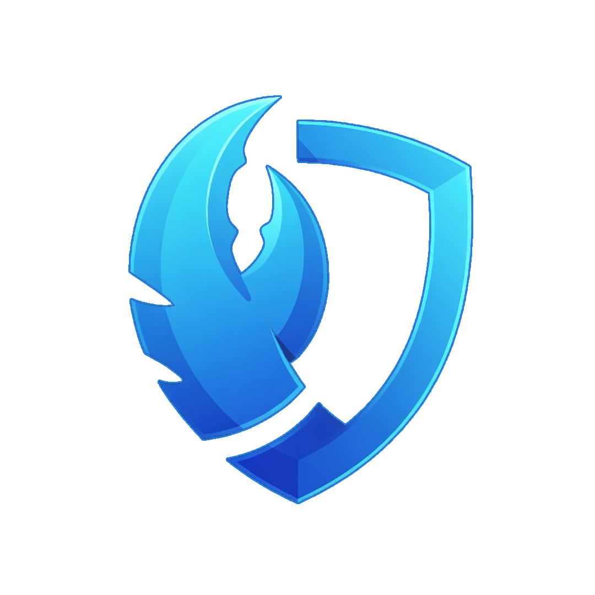

# ClawSafe

**Verify Claw skills before you install them.** Scan ClawHub / OpenClaw skills for wallet-drain patterns, data exfiltration, shell injection, and related threats.




## What it does

- Skill scan form + history UI  
- Multi-layer analysis story (e.g. VirusTotal + AI-oriented checks)  
- Waitlist for early access  
- Dark, security-console visual language  

## Stack

| Layer | Tech |
|-------|------|
| App | Next.js, TypeScript, Tailwind |
| Backend | Supabase, Anthropic SDK (scan pipeline) |
| Hosting | Netlify (`netlify.toml`) |

## Quick start

```bash
npm install
# set required env vars (Supabase, Anthropic, etc.) — never commit .env
npm run dev
npm run build
```

## Security

This repository is **public**. Keep API keys and `.env` local / in the host only. Do not commit secrets.

## License

All rights reserved.
